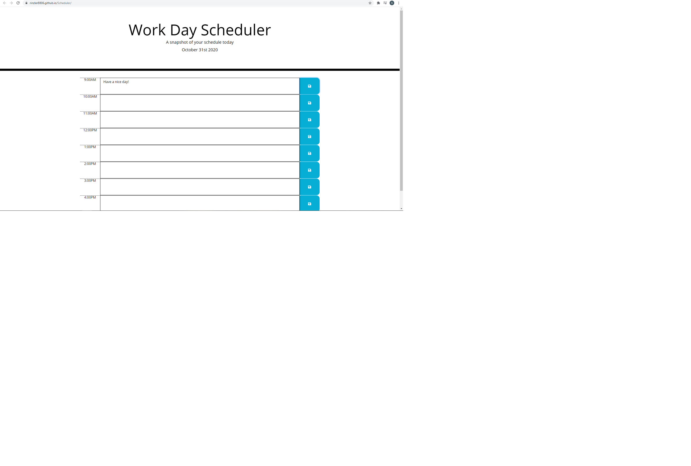

**Scheduler Readme**

The purpose of this application is to add a dynamic scheduler that allows the user to document what they will need reminders for during the work day (9AM-5PM).
Additionally, the date will change in the header to reflect the current month/day/year.
The user can enter whatever activities they would like for a specific hour and then save these activities, so that they will be available if they choose to leave and come back to the page later on.

Please visit the following address to update your daily schedule! https://rinzler8806.github.io/Scheduler/

